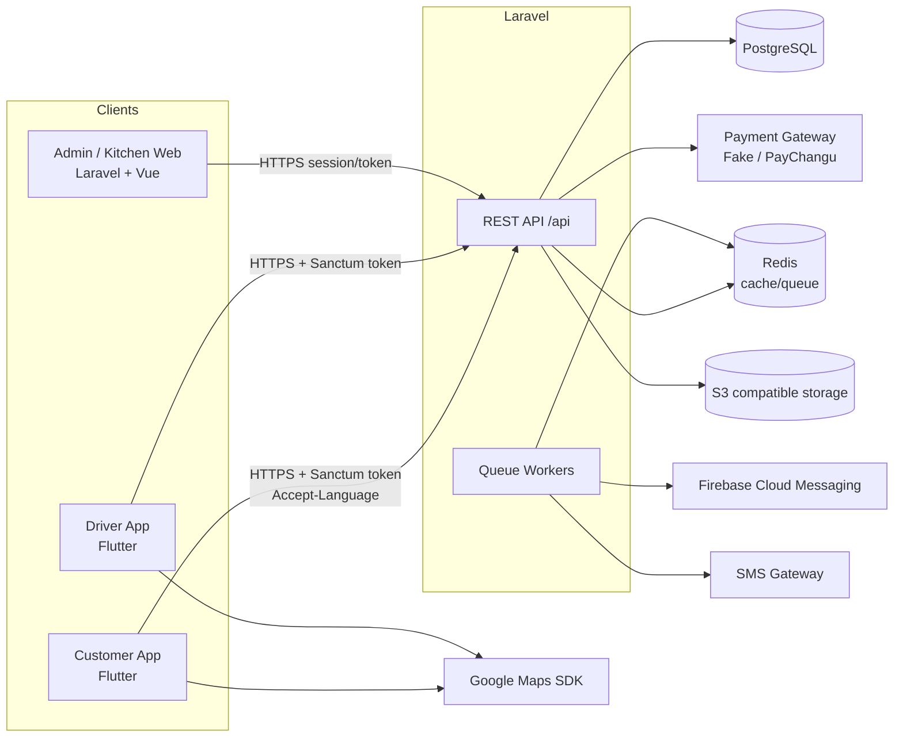

# Architecture — Malawi Bento Delivery Platform

> 対象: MVP（Lilongwe 1号店）から FC 方式での全国展開、将来的な Food / Grocery / Parcel 等の
> マラウイ全国配送プラットフォームまでを見据えた全体設計。

---

## 1. ゴールと設計原則

| 原則 | 内容 |
|---|---|
| **Multi-tenant from day one** | `Organization → Franchise → Store → Kitchen → DeliveryZone` の階層を最初から DB/権限に組み込む。MVP は各 1 件で運用。 |
| **i18n from day one** | UI 文言・商品名・通知文をコードにハードコードしない。Locale ベースの共通翻訳方式のみを使い、`if (lang == "ja")` のような分岐を作らない。 |
| **Codes, not sentences** | API は `code` / `status` を返し、表示文字列はクライアントが翻訳する。DB に表示用文字列を保存しない。 |
| **Thin controllers** | Controller → FormRequest (validation) → Service (business logic) → Model。 |
| **Replaceable integrations** | Payment / SMS / Push / Map / Storage は Interface 経由。`.env` で差し替え。 |
| **Low-bandwidth first** | 軽量レスポンス、画像圧縮、キャッシュ、Driver App のオフライン再送。 |
| **Simplest thing that ships** | 迷ったら MVP を最も早く安全にリリースできる方法を選ぶ。ただしテナント分離・RBAC・i18n は妥協しない。 |

---

## 2. リポジトリ構成

```
/
├── backend/          Laravel 13 (REST API + Admin/Kitchen Web)  ← PHASE 1
├── customer-app/     Flutter (顧客アプリ)                         ← PHASE 2
├── driver-app/       Flutter (配達員アプリ)                       ← PHASE 4
├── docs/             設計ドキュメント
├── docker-compose.yml
└── README.md
```

### backend 内部構成

```
backend/
├── app/
│   ├── Enums/                 UserRole, Permission, OrderStatus, ErrorCode ...
│   ├── Exceptions/            ApiException (code ベースのドメイン例外)
│   ├── Http/
│   │   ├── Controllers/Api/         顧客/共通 API
│   │   ├── Controllers/Api/Admin/   管理 API (RBAC + テナントスコープ)
│   │   ├── Middleware/              SetLocale, EnsureRole ...
│   │   ├── Requests/                FormRequest (validation)
│   │   └── Resources/               API Resource (レスポンス整形)
│   ├── Models/                Eloquent Models (+ Concerns/HasTranslations, BelongsToTenant)
│   ├── Policies/              モデル単位の認可
│   ├── Services/              Business Logic (Auth, Store, Catalog, Locale, Delivery, Payment ...)
│   │   └── Contracts/         SmsGateway, PaymentGatewayInterface ...
│   └── Support/               ApiResponse, PhoneNumber, Geo ...
├── config/bento.php           プラットフォーム固有設定 (OTP, locale, currency, geo)
├── lang/{en,ny,ja}/           Backend 翻訳ファイル (Laravel 9+ の標準位置。= 旧 resources/lang)
├── database/{migrations,seeders,factories}
└── tests/{Feature,Unit}
```

---

## 3. システム構成図



---

## 4. テナント（FC）モデル

```
Organization (Malawi Bento)
 └── Franchise (Lilongwe Franchise, commission_rate ...)
      └── Store (Lilongwe Central Store)
           ├── Kitchen (Lilongwe Central Kitchen)
           └── DeliveryZone (Lilongwe Central 8km)
```

* `stores / kitchens / delivery_zones / drivers / orders` は **`organization_id` と `franchise_id` を非正規化して保持**する。
  テナントスコープのクエリを JOIN なしで高速・単純に書けるようにするため。整合性は Service 層で親から導出して保証する
  （クライアント入力から `franchise_id` を受け取らない）。
* 商品カタログ（categories / products / options）は **Organization 単位**。店舗ごとの販売可否・価格上書き・在庫は
  `store_products` で管理する。
* 新地域展開 = 管理画面から `Add Franchise → Add Store → Add Kitchen → Add Delivery Zone` のみ。コード変更不要。
* 将来の業態拡張（Grocery / Daily Goods / Parcel / Shopping）に備え、`stores.business_type`（MVP は `FOOD` のみ）を持つ。

### テナントスコープの実装

`App\Models\Concerns\BelongsToTenant` trait が `scopeVisibleTo(User $user)` を提供し、各モデルは
`tenantColumns()` で「organization / franchise / store を表すカラム名」を宣言する。

| ロール | 見える範囲 |
|---|---|
| SUPER_ADMIN | 全データ（プラットフォーム全体） |
| FRANCHISE_ADMIN | `franchise_id = user.franchise_id` |
| STORE_MANAGER / KITCHEN_STAFF | `store_id = user.store_id` |
| DRIVER | 自分に割り当てられた配送のみ（PHASE 4） |
| CUSTOMER | 自分の注文・住所のみ（`user_id` 一致） |

一覧は必ず `Model::query()->visibleTo($user)`、単一リソースは Policy で `TenantAuthorizer` を使って判定する。
他テナントのリソースを ID 指定で取得した場合は **404 (RESOURCE_NOT_FOUND)** を返し、存在自体を漏らさない。

---

## 5. RBAC

ロールは `users.role`（`App\Enums\UserRole`）で 1 ユーザー 1 ロール。
権限は `App\Enums\Permission` とロール→権限のマップで定義し、コード内でロール名を直接比較しない
（`$user->hasPermission(Permission::STORES_UPDATE)`）。

| Permission | SUPER_ADMIN | FRANCHISE_ADMIN | STORE_MANAGER | KITCHEN_STAFF | DRIVER | CUSTOMER |
|---|:-:|:-:|:-:|:-:|:-:|:-:|
| organizations.manage | ✔ | | | | | |
| franchises.view | ✔ | own | | | | |
| franchises.manage (create/update/delete) | ✔ | | | | | |
| stores.view | ✔ | own FC | own | own | | |
| stores.create / delete | ✔ | | | | | |
| stores.update | ✔ | own FC | own | | | |
| kitchens.view | ✔ | own FC | own | own | | |
| kitchens.manage | ✔ | own FC | | | | |
| delivery_zones.view | ✔ | own FC | own | | | |
| delivery_zones.manage | ✔ | own FC | own | | | |
| catalog.view (categories/products) | ✔ | ✔ | ✔ | ✔ | | |
| catalog.manage | ✔ | | | | | |
| store_products.manage (販売可否/価格/在庫) | ✔ | own FC | own | | | |
| languages.manage | ✔ | | | | | |
| translations.manage | ✔ | | | | | |
| audit_logs.view | ✔ | own FC | | | | |
| orders.view / kitchen.operate | ✔ | own FC | own | own | | |
| drivers.manage | ✔ | own FC | own | | | |
| sales.view | ✔ | own FC | own | | | |
| delivery.operate | | | | | ✔ | |
| customer.* (注文/住所) | | | | | | ✔ |

「own FC / own」の判定は Permission チェックの **後に** テナントスコープで行う（2 段階）。

---

## 6. リクエスト処理フロー

```
Request
 → SetLocale middleware        (Accept-Language → user.preferred_language → default 'en')
 → auth:sanctum                (必要なルートのみ)
 → EnsureRole / Policy         (RBAC + tenant scope)
 → FormRequest                 (validation, localized messages)
 → Controller                  (薄い。Service を呼ぶだけ)
 → Service                     (business logic, transactions, audit log)
 → API Resource                (軽量 JSON)
 → ApiResponse envelope
```

### API レスポンス形式（統一）

成功:
```json
{ "success": true, "data": { ... }, "meta": { "locale": "ja" } }
```
一覧（ページネーション）:
```json
{ "success": true, "data": [ ... ], "meta": { "locale": "en", "pagination": { "current_page": 1, "per_page": 20, "total": 42, "last_page": 3 } } }
```
エラー:
```json
{ "success": false, "error": { "code": "VALIDATION_FAILED", "message": "…(localized)…", "fields": { "phone": ["…"] } } }
```

* `error.code` は `App\Enums\ErrorCode`（英語の大文字スネーク）。クライアントはこれをキーに翻訳する。
* `error.message` は Backend の `lang/{locale}/errors.php` から解決した補助メッセージ（ログ・デバッグ・フォールバック表示用）。
* ステータス類は常にコード（`COOKING` 等）で返し、表示文字列は返さない。

---

## 7. 多言語（概要）

詳細は [i18n.md](i18n.md)。

* 初期 Locale: `en`（default / fallback）, `ny`（Chichewa）, `ja`。
* `languages` テーブルで有効言語を管理。追加はレコード追加＋翻訳ファイル追加のみ。
* DB コンテンツは `*_translations` テーブル（`locale` 列）方式。
* アプリ UI 文言はアプリに同梱（オフラインで言語切替可能）。

---

## 8. 外部連携の抽象化

| 領域 | Interface | 開発 | 本番候補 | 切替 (.env) |
|---|---|---|---|---|
| Payment | `PaymentGatewayInterface` (`pay/verify/refund`) | `FakePaymentGateway` | PayChangu (Airtel Money / TNM Mpamba) | `PAYMENT_GATEWAY` |
| SMS | `SmsGateway` | `LogSmsGateway` | Africa's Talking / 現地 SMS aggregator | `SMS_DRIVER` |
| Push | `PushNotifier` | log | Firebase Cloud Messaging | `FIREBASE_*` |
| Map | — (クライアント SDK) | Google Maps | Google Maps | `GOOGLE_MAPS_API_KEY` |
| Storage | Laravel Filesystem | local | S3 互換 (Wasabi / MinIO / AWS) | `FILESYSTEM_DISK`, `AWS_*` |
| OTP | `OtpService` | 固定コード `123456` (`OTP_TEST_MODE`) | SMS 送信 | `OTP_TEST_MODE`, `OTP_TEST_CODE` |

`OTP_TEST_MODE` は `APP_ENV=production` では **強制的に無効** になる（設定ミスによる事故防止）。

---

## 9. 金額・通貨

* 金額はすべて **最小通貨単位の整数（minor units）** で保存・計算する（MWK は exponent 2 = tambala）。
  例: MK 3,500.00 → `350000`。浮動小数点誤差を排除し、bcmath 等の拡張にも依存しない。
* 通貨コードは `stores.currency`（MVP は `MWK`）。API は `{ "price": 350000, "currency": "MWK" }` を返す。
* 表示は必ずクライアントの Locale 対応 Formatter（Flutter `NumberFormat.currency`）で行い、文字列結合しない。

---

## 10. 位置情報・配送エリア

* 店舗検索 `StoreLocatorService::findAvailableStores(lat, lng)`:
  1. バウンディングボックスで候補の有効ゾーンを SQL 絞り込み
  2. Kitchen（無ければ Store）座標からの Haversine 距離を計算
  3. `distance <= max_delivery_distance_km` のゾーンを採用し、配送料を算出
  4. 距離順で返却（Store, Kitchen, Zone, distance_km, delivery_fee, is_open）
* 配送料: `base_fee + ceil(max(0, distance - base_distance_km)) × additional_fee_per_km`
* 将来: `delivery_zones.polygon`（GeoJSON）対応、PostGIS への移行（Interface は不変）。

---

## 11. 通信環境対策

| 対象 | 施策 |
|---|---|
| API | Resource で必要最小限のフィールド、要求 Locale ＋ fallback の翻訳のみ eager load、ページネーション、gzip |
| 画像 | S3 にリサイズ済み (WebP, 〜400px) を保存、アプリ側 lazy load + ディスクキャッシュ |
| Customer App | カテゴリ/商品一覧を短時間キャッシュ、翻訳ファイルはアプリ同梱 |
| Driver App | 現在の配送をローカル DB 保存、失敗リクエストは送信キュー、GPS 点はローカルにバッファし復旧後まとめて送信（`recorded_at` 付き） |

---

## 12. 非機能

* **Timezone**: DB は UTC 保存、`stores.timezone`（`Africa/Blantyre`）で営業時間判定・表示。
* **監査ログ**: 管理操作・重要設定（言語変更含む）は `audit_logs` に before/after を保存。
* **ログ**: Laravel log channel（本番は stack + daily）。外部連携の失敗は必ず warning 以上で記録。
* **Rate limit**: `send-otp` は電話番号単位＋ IP 単位で制限。
* **Soft delete**: 注文から参照される franchises / stores / kitchens / products / categories は論理削除。

---

## 13. 将来拡張ポイント

| 拡張 | 対応方針 |
|---|---|
| 新地域・新 FC | 管理画面操作のみ |
| 新言語 | `languages` に追加 + `lang/{code}` + ARB 追加（コード変更なし） |
| 新通貨 | `stores.currency` + 通貨 exponent 設定 |
| 新業態 | `stores.business_type` + カテゴリ体系の拡張 |
| Polygon ゾーン | `delivery_zones.polygon` + PostGIS |
| 複数ロール/複数店舗兼務 | `users.role` → `role_assignments` テーブルへ移行（Permission API は不変） |
| 決済プロバイダ追加 | `PaymentGatewayInterface` 実装を追加し `.env` で切替 |
