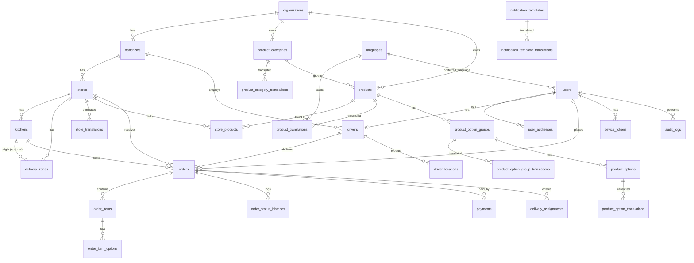
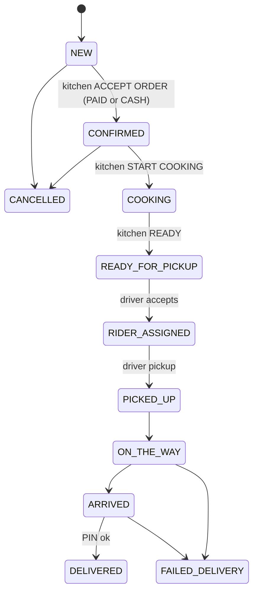

# Database Design

* RDBMS: **PostgreSQL 16**（MySQL 8 でも動作するよう、DB 固有機能は使わない）
* 全テーブル: `id` bigint PK, `created_at` / `updated_at`（UTC）
* 金額: **bigint minor units**（MWK 3,500.00 → `350000`）
* 表示用文字列（ステータス名など）は保存しない。ステータスは英大文字コード（`COOKING`）
* 翻訳: `<entity>_translations(<entity>_id, locale, ...)`、`unique(<entity>_id, locale)`、`locale` は `languages.code` への FK
* 列の「Phase」は実装フェーズ。PHASE 1 以外は設計のみ（マイグレーションは該当フェーズで作成）

---

## 1. ER 図

---

## 2. テーブル一覧

| # | Table | 概要 | Phase |
|---|---|---|---|
| 1 | organizations | 事業体（Malawi Bento） | 1 |
| 2 | franchises | FC | 1 |
| 3 | stores | 店舗 | 1 |
| 4 | store_translations | 店舗説明・お知らせ（翻訳） | 1 |
| 5 | kitchens | 厨房 | 1 |
| 6 | delivery_zones | 配送エリア | 1 |
| 7 | languages | 対応言語 | 1 |
| 8 | users | 全ユーザー（顧客・スタッフ・配達員） | 1 |
| 9 | otp_codes | SMS OTP | 1 |
| 10 | personal_access_tokens | Sanctum | 1 |
| 11 | user_addresses | 顧客住所 | 1 |
| 12 | product_categories / product_category_translations | カテゴリ | 1 |
| 13 | products / product_translations | 商品 | 1 |
| 14 | product_option_groups / product_option_group_translations | オプショングループ | 1 |
| 15 | product_options / product_option_translations | オプション | 1 |
| 16 | store_products | 店舗別 販売可否・価格・在庫 | 1 |
| 17 | audit_logs | 監査ログ | 1 |
| 18 | orders | 注文 | 3 |
| 19 | order_items / order_item_options | 注文明細（スナップショット） | 3 |
| 20 | order_status_histories | ステータス遷移履歴 | 3 |
| 21 | drivers | 配達員 | 4 |
| 22 | delivery_assignments | 配達依頼（オファー/承諾/辞退） | 4 |
| 23 | driver_locations | GPS 履歴 | 4 |
| 24 | payments | 決済 | 5 |
| 25 | notification_templates / notification_template_translations | 通知テンプレート | 5 |
| 26 | device_tokens | FCM トークン | 5 |
| 27 | notification_logs | 送信ログ（Push/SMS/Email） | 5 |
| 28 | settings | システム設定（key/value, スコープ付き） | 6 |

Laravel 標準の `cache`, `jobs`, `failed_jobs`, `sessions`, `password_reset_tokens` も利用。

---

## 3. テーブル定義

### organizations (P1)
| column | type | note |
|---|---|---|
| id | bigint PK | |
| name | varchar(150) | 固有名（翻訳不要） |
| slug | varchar(80) unique | |
| default_locale | varchar(10) FK languages.code | |
| currency | char(3) | `MWK` |
| timezone | varchar(64) | `Africa/Blantyre` |
| is_active | bool | |

### franchises (P1)
| column | type | note |
|---|---|---|
| organization_id | FK organizations | index |
| code | varchar(40) | unique(organization_id, code) |
| name | varchar(150) | `Lilongwe Franchise` |
| owner_name | varchar(150) nullable | |
| phone, email | nullable | |
| region | varchar(80) | `Central`, `Southern`, `Northern` |
| status | varchar(20) | `PENDING` / `ACTIVE` / `SUSPENDED` |
| commission_rate | decimal(5,2) | % |
| deleted_at | timestamp | soft delete |

### stores (P1)
| column | type | note |
|---|---|---|
| organization_id | FK | 非正規化（franchise から導出） |
| franchise_id | FK | index |
| code | varchar(40) unique | `LLW-CENTRAL` |
| name | varchar(150) | 固有名 |
| business_type | varchar(20) | `FOOD`（将来 `GROCERY`, `PARCEL` …） |
| phone, email | nullable | |
| city | varchar(80) | `Lilongwe` |
| address | varchar(255) nullable | |
| latitude, longitude | decimal(10,7) | |
| timezone | varchar(64) | |
| currency | char(3) | |
| opening_hours | json nullable | `{"mon":[["08:00","20:00"]], ...}` null=常時 |
| is_active | bool | |
| is_accepting_orders | bool | 一時停止スイッチ |
| deleted_at | timestamp | |

### store_translations (P1)
`store_id` FK cascade, `locale` FK, `description` text nullable, `announcement` text nullable, unique(store_id, locale)

### kitchens (P1)
`organization_id`, `franchise_id`, `store_id` FK（非正規化）, `name`, `latitude`/`longitude` nullable（null→店舗座標）, `is_active`, `deleted_at`

### delivery_zones (P1)
| column | type | note |
|---|---|---|
| organization_id, franchise_id, store_id | FK | 非正規化 |
| kitchen_id | FK nullable | 配送起点。null→店舗 |
| name | varchar(120) | 内部名（翻訳不要） |
| base_fee | bigint | minor units |
| base_distance_km | decimal(6,2) | |
| additional_fee_per_km | bigint | minor units |
| max_delivery_distance_km | decimal(6,2) | |
| polygon | json nullable | 将来 GeoJSON |
| is_active | bool | |

### languages (P1)
| column | type | note |
|---|---|---|
| code | varchar(10) unique | BCP-47 (`en`, `ny`, `ja`, `zh-Hans`, `pt`…) |
| name | varchar(60) | 英語名 `Chichewa` |
| native_name | varchar(60) | `Chichewa`, `日本語` |
| direction | varchar(3) | `ltr` / `rtl` |
| is_active | bool | |
| is_default | bool | 1 件のみ（Service で保証） |
| sort_order | int | |

### users (P1)
| column | type | note |
|---|---|---|
| name | varchar(150) nullable | OTP 登録直後は null 可 |
| phone | varchar(20) unique nullable | E.164 `+265991234567` |
| email | unique nullable | |
| password | nullable | スタッフのみ（顧客/配達員は OTP） |
| role | varchar(30) | `UserRole` |
| organization_id, franchise_id, store_id | FK nullable | スタッフの所属スコープ |
| preferred_language | varchar(10) FK languages.code | default `en` |
| is_active | bool | |
| phone_verified_at, last_login_at | timestamp nullable | |

### otp_codes (P1)
`phone` index, `code_hash`, `purpose`（`LOGIN`）, `attempts`, `expires_at`, `consumed_at` nullable, `ip_address`

### user_addresses (P1)
`user_id` FK cascade, `name`（`Home`, `Office` – ユーザー入力）, `latitude`, `longitude`, `area`, `street`, `building`, `landmark`, `delivery_note`, `phone`, `is_default`

### product_categories (P1)
`organization_id` FK, `code` unique(org, code), `image_url`, `sort_order`, `is_active`, `deleted_at`
→ `product_category_translations(category_id, locale, name)`

### products (P1)
| column | type | note |
|---|---|---|
| organization_id | FK | |
| category_id | FK product_categories | |
| sku | varchar(60) | unique(organization_id, sku) |
| image_url | varchar nullable | |
| price | bigint | 基本価格（minor units） |
| preparation_minutes | smallint | |
| is_featured | bool | Home の「おすすめ」 |
| is_active | bool | |
| sort_order | int | |
| deleted_at | timestamp | |
→ `product_translations(product_id, locale, name, description)`

### store_products (P1)
`store_id`, `product_id`, `is_available`, `price` bigint nullable（null→products.price）, `stock_quantity` int nullable（null→在庫管理しない）, `sort_order`, unique(store_id, product_id)

### product_option_groups (P1)
`product_id` FK cascade, `min_select`, `max_select`, `sort_order`
→ `product_option_group_translations(option_group_id, locale, name)`

### product_options (P1)
`option_group_id` FK cascade, `price` bigint（追加料金）, `is_active`, `sort_order`
→ `product_option_translations(option_id, locale, name)`

### audit_logs (P1)
`user_id` FK nullable, `organization_id`, `franchise_id` nullable（スコープ閲覧用）, `action`（`franchise.created`, `user.language_changed` …）, `target_type`, `target_id`, `before` json, `after` json, `ip_address`, `created_at`

### orders (P3)
| column | type | note |
|---|---|---|
| order_number | varchar(40) unique | `{店舗コード}-{yymmdd}-{連番}` 例 `LLW-CENTRAL-260929-0001` |
| organization_id, franchise_id, store_id, kitchen_id | FK | テナント |
| customer_id | FK users | |
| delivery_address_id | FK user_addresses nullable | 参照用（住所は下記にスナップショット） |
| delivery_zone_id | FK nullable | |
| driver_id | FK drivers nullable | |
| status | varchar(30) | `OrderStatus` |
| payment_status | varchar(20) | `PENDING/PAID/FAILED/REFUNDED` |
| payment_method | varchar(20) | `CASH/AIRTEL_MONEY/TNM_MPAMBA` |
| currency | char(3) | |
| subtotal, delivery_fee, service_fee, discount, total | bigint | |
| delivery_latitude, delivery_longitude | decimal(10,7) | |
| delivery_address_snapshot | json | 住所文字列（ユーザー入力値） |
| delivery_distance_km | decimal(6,2) | |
| delivery_pin | varchar(4) | ハッシュ化不要（短命・顧客表示用）。検証試行回数を制限 |
| locale | varchar(10) | 注文時の言語 |
| scheduled_at | nullable | 予約注文 |
| ordered_at, accepted_at (= CONFIRMED), cooking_started_at, ready_at, assigned_at, picked_up_at, arrived_at, delivered_at, cancelled_at | timestamp nullable | 遷移先ステータス → 列は `OrderStatus::timestampColumn()` |
| cancel_reason_code | varchar(40) nullable | コードのみ |

index: (store_id, status), (franchise_id, created_at), (customer_id, created_at)

### order_items (P3)
`order_id`, `product_id`, `locale`, `product_name_snapshot`, `product_description_snapshot` nullable, `quantity`, `unit_price`, `option_amount`, `total`

### order_item_options (P3)
`order_item_id`, `option_id`, `option_name_snapshot`, `price`

### order_status_histories (P3)
`order_id`, `from_status`, `to_status`, `actor_user_id`, `created_at`

### drivers (P4)
`user_id` unique, `organization_id`, `franchise_id`, `store_id` nullable, `vehicle_type`（`MOTORBIKE/BICYCLE/CAR`）, `vehicle_number`, `status`（`ACTIVE/SUSPENDED`）, `is_online`, `current_latitude`, `current_longitude`, `location_updated_at`, `rating` decimal(3,2)

### delivery_assignments (P4)
`order_id`, `driver_id`, `status`（`OFFERED/ACCEPTED/DECLINED/EXPIRED`）, `offered_at`, `responded_at`, `expires_at`

### driver_locations (P4)
`driver_id`, `order_id` nullable, `latitude`, `longitude`, `recorded_at`（端末時刻, オフライン再送対応）, `created_at`

### payments (P5)
`order_id`, `method`, `gateway`（`fake`, `paychangu`）, `status`（`PENDING/PAID/FAILED/REFUNDED`）, `amount`, `currency`, `phone`, `reference` unique（自社採番, ゲートウェイの tx_ref）, `gateway_reference` nullable, `failure_code`, `payload` json, `paid_at`, `refunded_at`

### notification_templates (P5)
`code`（`ORDER_CONFIRMED`）, `channel`（`PUSH/SMS/EMAIL`）, unique(code, channel)
`is_active` → `notification_template_translations(template_id, locale FK, title, body)`

### device_tokens (P5)
`user_id`, `token` unique, `platform`, `app`（`customer/driver`）, `last_seen_at`

### notification_logs (P5)
`user_id`, `order_id` nullable, `channel`, `template_code`, `locale`（実際に使われた言語）, `status`（`SENT/QUEUED/FAILED`）, `error`, `created_at`

### settings (P6)
`scope_type`（`GLOBAL/ORGANIZATION/FRANCHISE/STORE`）, `scope_id` nullable, `key`, `value` json, unique(scope_type, scope_id, key)。
解決順 STORE → FRANCHISE → ORGANIZATION → GLOBAL → config（`SettingsService`）。キーは `SettingsService::DEFINITIONS` に登録したもののみ

---

## 4. Enum 一覧（DB 保存値）

| Enum | 値 |
|---|---|
| UserRole | SUPER_ADMIN, FRANCHISE_ADMIN, STORE_MANAGER, KITCHEN_STAFF, DRIVER, CUSTOMER |
| FranchiseStatus | PENDING, ACTIVE, SUSPENDED |
| BusinessType | FOOD（将来: GROCERY, DAILY_GOODS, PARCEL, SHOPPING） |
| OrderStatus | NEW, CONFIRMED, COOKING, READY_FOR_PICKUP, RIDER_ASSIGNED, PICKED_UP, ON_THE_WAY, ARRIVED, DELIVERED, CANCELLED, FAILED_DELIVERY |
| PaymentStatus | PENDING, PAID, FAILED, REFUNDED |
| PaymentMethod | CASH, AIRTEL_MONEY, TNM_MPAMBA |
| VehicleType | MOTORBIKE, BICYCLE, CAR |
| OtpPurpose | LOGIN |

### 注文ステータス遷移 (P3)

> 厨房画面の「ACCEPT ORDER」は `NEW → CONFIRMED`（Mobile Money は `payment_status=PAID` の場合のみ可、CASH は即可）、「START COOKING」は `CONFIRMED → COOKING`、
> 「READY」は `COOKING → READY_FOR_PICKUP`。遷移表は `OrderStatus::canTransitionTo()` に一元化。
> 表示時の短縮ラベル（厨房画面の「READY」）はあくまで翻訳キー側の話であり、内部コードは `READY_FOR_PICKUP` のまま。

---

## 5. インデックス／整合性方針

* すべての FK に index。親削除は原則 `restrict`（翻訳・住所・オプション等の従属データは `cascade`）。
* テナント検索用に `(franchise_id)`, `(store_id)` index。
* 一意性: `stores.code`, `(organization_id, sku)`, `(store_id, product_id)`, `(entity_id, locale)`。
* `users.phone` は E.164 正規化後に一意。
